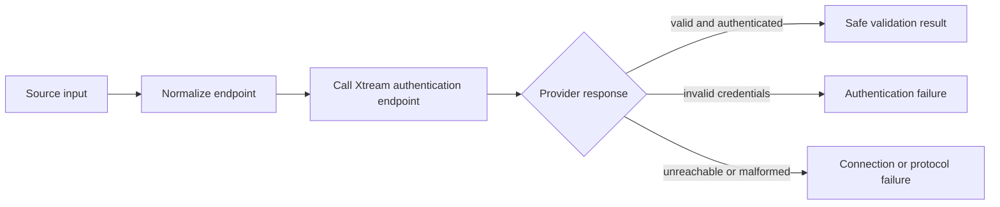
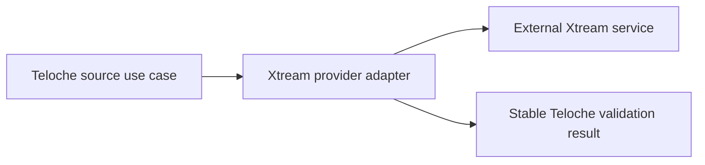

# Step 1: Understand One Xtream Source

This is the first design step after the repository reset. It describes one
thing only: what an Xtream source is and what it means to validate one.

There is deliberately no database schema, HTTP framework, Cloudflare setup, TV
screen, authentication system, or catalog synchronization in this document.

## The goal

Given an endpoint, a username, and a password, Teloche should be able to answer
one safe question:

> Can this Xtream source be reached and authenticated, and what basic account
> information does the provider expose?

The first implementation should stop after answering that question. It should
not fetch the channel list yet.

## What a source contains

Conceptually, a source has:

```text
Source
├── name                 chosen by the Teloche user
├── provider protocol    Xtream for this first step
├── endpoint             provider base URL
└── access configuration  username and password, kept private
```

The source is our concept. The provider response is not our domain model. We
will translate the provider response into a small, stable Teloche result.

## The first behavior

The first source operation is validation:



For an Xtream-compatible provider, the observed validation call is the
provider's `player_api.php` endpoint with the username and password query
parameters. The exact provider response must be parsed at this boundary; it
must not leak directly into the rest of the application.

## Safe result

The result may contain information useful to the user, such as:

- whether the source is reachable;
- whether authentication succeeded;
- the provider identity, if reliably available;
- account status or expiration, if reliably available;
- a small list of provider capabilities, if reliably available.

The result must not contain:

- the password;
- a URL containing the password;
- the raw provider response;
- an assumption that every Xtream server returns the same optional fields.

## First acceptance criteria

The first implementation is complete only when these cases are understood and
tested:

1. A valid HTTP or HTTPS endpoint can be normalized consistently.
2. A valid source can be authenticated against a provider fixture or an
   explicitly authorized test provider.
3. Invalid credentials produce a clear authentication failure.
4. A malformed endpoint is rejected before a provider request is made.
5. Network failure, timeout, non-JSON data, and unexpected JSON are distinct
   enough to diagnose.
6. No test output, returned value, or log contains the password.
7. The behavior can be tested without D1, Cloudflare, Android, or a real TV
   application.

## Deliberately deferred

These are important, but they are not part of the first step:

- saving sources in a database;
- users, households, and permissions;
- listing or synchronizing live channels;
- EPG, VOD, series, recordings, or favorites;
- generating playback URLs;
- proxy mode, DRM, and buffering diagnostics;
- supporting M3U, XMLTV, Stalker, or another provider protocol;
- choosing the public HTTP API;
- choosing Cloudflare, D1, or the TV framework.

The future architecture should remain provider-agnostic, but we do not need to
build that architecture everywhere yet. The only boundary we need now is:



## The next decision

Before writing implementation code, review this document and settle three
questions:

1. Is “source validation” the correct first operation, or should the first
   operation only normalize and store a source draft?
2. Which account fields are useful enough to expose after validation?
3. Should the first test use a recorded provider response, a local fake HTTP
   server, or an authorized live provider?

Once those answers are fixed, the next step will be a small pure implementation
of this behavior and its tests. Nothing else should be built yet.
