# Revue d'architecture de Teloche

> Document de revue du code existant. Il decrit l'etat reel de l'implementation
> au 18 juillet 2026 : ce qui fonctionne deja, les choix temporaires et ce qui
> reste intentionnellement a concevoir.

## TL;DR

Teloche est un monorepo pour une future application IPTV Android TV et son
backend. Le client TV n'est **pas encore implemente** : `apps/tv/App.tsx` est le
placeholder genere par Expo TV. L'essentiel du travail realise est donc le
socle backend.

Le backend est un **Cloudflare Worker** ecrit avec **Effect 4**, utilisant une
base **Cloudflare D1**. Il ne demande pas au client TV de parler directement a
Xtream : le TV parlera a une API Teloche, et Xtream est un premier adaptateur
interne. Cette frontiere est le choix structurant du projet : elle permet plus
tard d'ajouter M3U/XMLTV, Stalker/MAG ou un autre fournisseur sans propager leur
format dans le client.

Aujourd'hui, le backend sait :

- creer un utilisateur et son foyer initial ;
- partager les sources par foyer et controler l'acces par role ;
- enregistrer une source Xtream, avec son endpoint et ses identifiants chiffres ;
- verifier les identifiants aupres de Xtream ;
- synchroniser les categories et chaines TV en direct Xtream ;
- servir les chaines synchronisees via une API Teloche documentee avec Scalar ;
- construire une URL de lecture Xtream a la demande, en mode lecture directe.

Ce qui n'est pas encore fait est tout aussi important : pas de vraie
authentification, pas de pairage TV, pas de synchronisation planifiee, pas
d'EPG, pas de VOD/series, pas de favoris, pas de proxy media, pas de DRM ni de
client TV metier. Le header `x-teloche-user-id` est une bequille de developpement
et ne doit jamais etre traite comme une authentification de production.

```mermaid
flowchart LR
  TV[Client Android TV<br/>a construire] -->|API Teloche| API[Backend Teloche<br/>Effect 4 Worker]
  API -->|catalogue, droits, lecture| D1[(Cloudflare D1)]
  API -->|adaptateur Xtream| X[Xtream compatible<br/>player_api.php]
  TV -. mode direct actuel .->|HLS ou MPEG-TS| X
  API -. futur .-> P[Autres adaptateurs<br/>M3U/XMLTV, Stalker, ...]
```

Le prochain chantier prioritaire selon le fichier `docs/todo.md` est de
remplacer l'identite de developpement par une vraie authentification et un
pairage d'appareil TV. Avant d'ecrire un ecran TV, il faut stabiliser ce contrat
: comment un TV obtient et renouvelle une identite, et quel foyer il represente.
Le premier vertical slice TV viendra juste apres : pairage, selection d'une
source, liste de chaines, lecture.

## Carte du depot

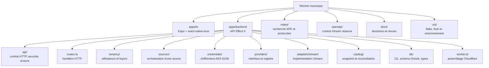

| Emplacement | Role actuel |
| --- | --- |
| `apps/tv` | Application Expo TV initialisee, sans fonctionnalite Teloche pour le moment. |
| `apps/backend/src/worker.ts` | Point d'entree du Worker. Assemble D1, les services Effect, le chiffrement et les routes. |
| `apps/backend/src/api` | Contrat HTTP genere en OpenAPI, middleware d'identite provisoire, schemas et erreurs. |
| `apps/backend/src/routes.ts` | Implementation des endpoints ; transforme les erreurs de domaine en reponses HTTP. |
| `apps/backend/src/tenancy` | Utilisateurs, foyers et appartenances a un foyer. |
| `apps/backend/src/sources` | Cas d'usage autour d'une source : creation, validation, synchronisation, catalogue et lecture. |
| `apps/backend/src/credentials` | Chiffrement, stockage et dechiffrement des identifiants fournisseur. |
| `apps/backend/src/providers` | Contrat fournisseur neutre et registre des adaptateurs disponibles. |
| `apps/backend/src/adapters/xtream` | Requetes et normalisation du protocole Xtream observe. |
| `apps/backend/src/catalog` | Modele de snapshot fournisseur et ecriture/reconciliation dans D1. |
| `apps/backend/src/db` | Schema Drizzle, connexion Kysely vers D1 et ressources d'infrastructure. |
| `apps/backend/migrations` | Migrations SQL D1 versionnees. |
| `notes` | Resultats de decompilation et recherche protocolaire. Sources de connaissance, pas contrat de l'application. |
| `openapi/xtream-compatible.yaml` | Description non officielle de la surface Xtream observee ; documentation de reference, pas API Teloche. |
| `docs/backend-api.md` | Note courte de conception de l'API backend. |
| `docs/catalog-sync.md` | Note courte de conception de la synchronisation. |
| `docs/todo.md` | File de travail priorisee. |

## Les deux API a ne pas confondre

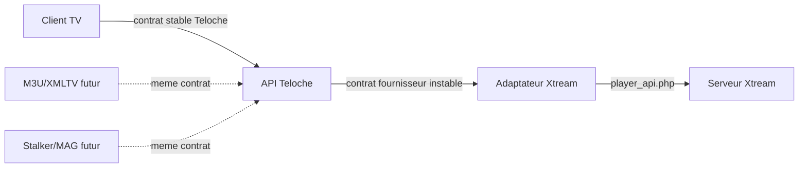

### API Teloche

C'est l'API que le client TV doit consommer. Elle est fournisseur-neutre : elle
parle de foyer, source, collection, chaine, synchronisation et descripteur de
lecture. Ses IDs sont internes a Teloche. Elle est decrite dans
`apps/backend/src/api/contract.ts`, exposee en OpenAPI a `/openapi.json` et
visualisee avec Scalar a `/docs`.

### API Xtream compatible

C'est une famille d'implementations non standardisee de fait. Les APK analyses
et le compte de test ont montre l'usage de `player_api.php`, des actions comme
`get_live_categories` et `get_live_streams`, ainsi que des URLs de lecture du
type `/live/{username}/{password}/{streamId}.m3u8`. Elle contient des
incoherences de type selon les fournisseurs : un meme identifiant peut etre un
nombre, une chaine ou `null`.

L'adaptateur Xtream absorbe ces variations et produit le modele commun. Le
client TV ne doit donc pas connaitre `stream_id`, `category_id`, ni les actions
`player_api.php`.

## Architecture backend en couches

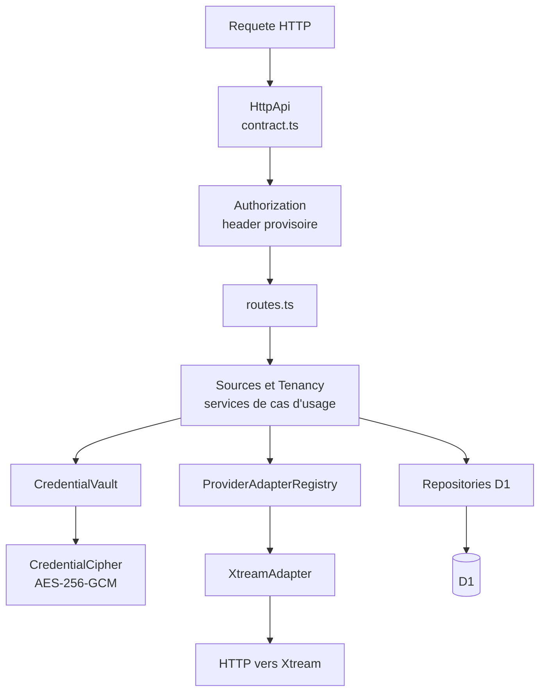

### Contrat et transport HTTP

`api/contract.ts` declare la surface HTTP avec `HttpApi`. Cette declaration est
la source du contrat OpenAPI de Teloche. `routes.ts` associe chaque endpoint a
son cas d'usage, borne les parametres de pagination et transforme les erreurs
internes en statuts HTTP previsibles : non authentifie, interdit, introuvable,
requete invalide, fournisseur indisponible ou erreur interne.

`HttpApiScalar` sert l'interface Scalar a `/docs`. Le document OpenAPI genere
est a `/openapi.json`. L'endpoint de documentation Xtream, lance par
`dev:xtream-docs`, est distinct : il sert uniquement le document d'observation
Xtream et ne participe pas a l'API metier Teloche.

### Identite et droits de foyer

Le middleware `Authorization` lit actuellement le header
`x-teloche-user-id`. Il le place dans le service Effect `CurrentUser`. Les
routes protegees passent ensuite cet ID aux services de domaine.

La regle est simple : une source appartient a un foyer ; un utilisateur ne peut
lire ou modifier une source que s'il appartient a son foyer. Les roles `owner`
et `admin` peuvent creer une source, verifier ses identifiants et lancer une
synchronisation. Le role `member` peut consulter le catalogue et demander une
lecture, mais ne peut pas administrer la source.

### Services de domaine

Les services sont le centre de l'application. Ils ne connaissent pas les
details HTTP. `Tenancy` porte l'inscription et la verification des droits de
foyer. `Sources` orchestre les operations sur une source : verifier les droits,
charger les identifiants, choisir l'adaptateur, lancer l'operation fournisseur,
et persister le resultat si necessaire.

Cela evite qu'une route HTTP sache comment est construite une URL Xtream ou
comment D1 est interrogee. C'est aussi la zone qui devra accueillir les regles
futures de profil, controle parental, capacites fournisseur et proxy.


### Adaptateurs fournisseur

`ProviderAdapter` est le contrat que tout fournisseur doit respecter :

- `validate` : verifier les identifiants et retourner l'etat du compte ;
- `makeCatalogProvider` : fournir un producteur de snapshot de catalogue ;
- `resolvePlayback` : construire un descripteur de lecture pour un item.

`ProviderAdapterRegistry` associe une cle comme `xtream` a une implementation.
Aujourd'hui, le registre ne contient que `XtreamAdapter`. Ajouter M3U/XMLTV ou
Stalker doit consister a implementer ce contrat, puis a enregistrer le nouvel
adaptateur, sans modifier l'API TV.

### Stockage D1

Drizzle est utilise pour declarer le schema et produire les migrations. Kysely
est utilise pour les requetes de l'application. Les requetes Kysely sont
compilees puis executees par la binding D1 native de Cloudflare.

Cette combinaison est volontaire : Drizzle garde le schema et les migrations
versionnes ; Kysely permet la construction typee des gros `upsert`. Lors d'une
synchronisation volumineuse, les ecritures sont decoupees sous la limite de
parametres lies de D1 puis envoyees par `D1Database.batch()`. Cela evite une
requete par chaine sans fabriquer du SQL par concatenation de texte.

### Effect et le Worker

Effect sert a modeliser les dependances et les erreurs. Un service comme
`CredentialVault` ou `Sources` est une dependance explicite du programme qui
l'utilise. Le Worker assemble ces services avec un `Context` Effect au moment
d'une requete : D1, client HTTP `fetch`, crypto Web, repositories, adaptateurs
et services metier.

Le meme code est execute localement par Wrangler et en production dans un
Cloudflare Worker. Alchemy decrit le Worker et la base D1 de production. Il n'y
a pas de serveur Node applicatif ni d'etape de build TypeScript explicite :
Wrangler prend l'entree Worker en charge.

## Modele de donnees global

Le modele commence par l'isolation multi-utilisateur. Une source IPTV n'est pas
la propriete directe d'un utilisateur, mais d'un foyer partageable.

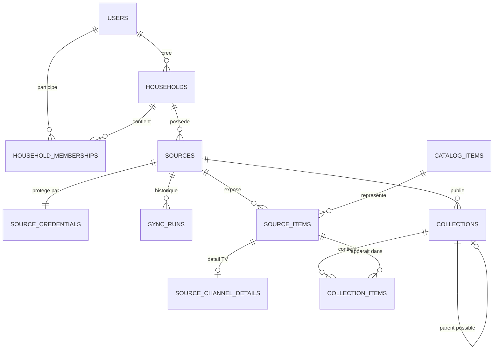

### Groupes de tables

| Groupe | Tables | Intention |
| --- | --- | --- |
| Identite | `users` | Identites applicatives. L'authentification qui les prouve reste a concevoir. |
| Partage | `households`, `household_memberships` | Un foyer possede des sources ; les memberships portent les roles. |
| Configuration fournisseur | `sources`, `source_credentials` | Une source est une souscription/connexion fournisseur. Les secrets chiffres sont separes de la configuration non secrete. |
| Operations | `sync_runs` | Journal durable de chaque tentative de synchronisation. |
| Catalogue fournisseur | `collections`, `source_items`, `source_channel_details`, `collection_items` | Vue synchronisee de ce qu'une source donne effectivement droit de voir. |
| Catalogue interne | `catalog_items` | Emplacement destine aux items canoniques Teloche. Il n'est pas encore reellement partage entre sources. |

### Lecture relationnelle

- Un **utilisateur** peut appartenir a plusieurs **foyers**.
- Un **foyer** peut avoir plusieurs **utilisateurs** et plusieurs **sources**.
- Une **source** est une connexion a un fournisseur particulier pour ce foyer.
- Une **collection** est une categorie, par exemple un groupe de chaines.
- Un **source item** est une chaine precise telle que le fournisseur la decrit
  dans une source : ID externe, nom, logo, ordre et disponibilite.
- Un **catalog item** est l'emplacement d'un item interne Teloche auquel un ou
  plusieurs `source_items` pourront un jour etre rattaches.
- `collection_items` exprime qu'une chaine peut appartenir a plusieurs
  categories et conserve son ordre dans chacune.

### Nuance capitale : canonique est une intention, pas encore une realite

Le schema separe deja `catalog_items` et `source_items`, ce qui est le bon point
de depart pour un catalogue canonique. Cependant, l'identifiant actuel d'un
`catalog_item` contient le `sourceId` et l'ID externe fournisseur. Deux sources
qui proposent France 2 produisent donc aujourd'hui deux `catalog_items`
distincts. Il n'existe encore ni rapprochement automatique par EPG/metadata, ni
fusion manuelle, ni identite globale de chaine.

Ne pas construire de fonctionnalite utilisateur en supposant qu'un
`catalog_item` est deja partage entre fournisseurs. Cette future decision devra
preciser les regles de rapprochement, les exceptions et les corrections
manuelles.

## Creation d'un utilisateur, d'un foyer et d'une source

### Inscription

`POST /v1/users` cree en une operation :

1. un `user` ;
2. un `household` dont cet utilisateur est createur ;
3. une `household_membership` avec le role `owner`.

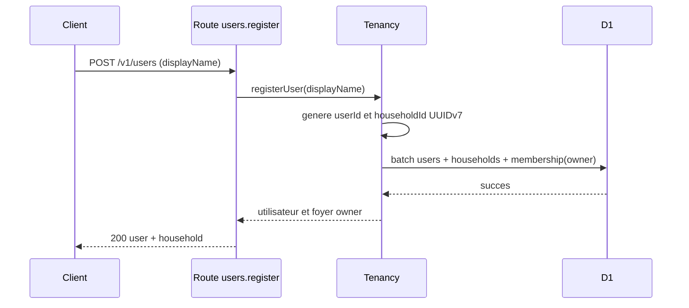

### Ajout d'une source Xtream

`POST /v1/households/:householdId/sources` attend un nom, un endpoint, un nom
d'utilisateur et un mot de passe. L'endpoint est refuse s'il contient deja des
identifiants, des parametres de query, un fragment, ou un protocole autre que
HTTP/HTTPS.

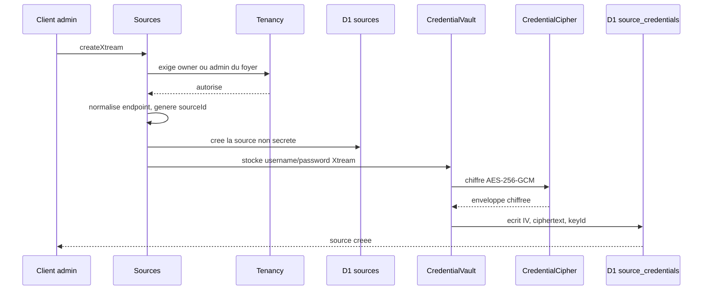

La creation ne contacte pas Xtream. La verification est une operation separee,
ce qui permet de corriger une source sans faire echouer une transaction locale
pour une indisponibilite reseau. Si l'ecriture du secret echoue apres la
creation de `sources`, le code supprime la source creee afin d'eviter une source
orpheline sans identifiants.


## Cycle Xtream : verification, synchronisation, lecture

### Verification des identifiants

`POST /v1/sources/:sourceId/validate` est reserve a `owner` et `admin`.
Le backend charge et dechiffre les identifiants, appelle
`player_api.php?username=...&password=...`, puis retourne un resume du compte :
statut, expiration eventuelle, nombre de connexions et formats de lecture
autorises. Il met aussi a jour l'etat et la date de derniere validation de la
source.

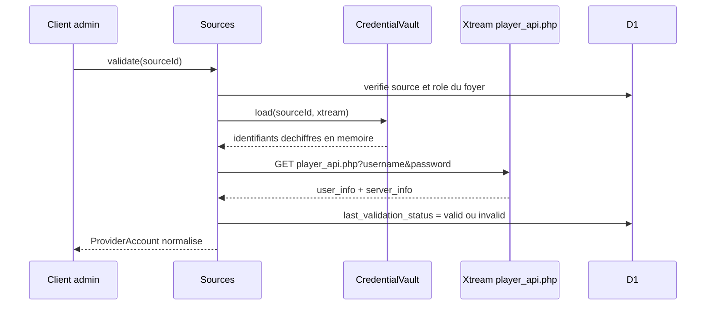

Les identifiants sont presents dans la query Xtream car c'est le protocole
observe. Ils ne sont ni mis dans D1 en clair, ni ecrits intentionnellement dans
des logs applicatifs.

### Premiere synchronisation du catalogue live

`POST /v1/sources/:sourceId/sync` est aujourd'hui manuel et reserve a `owner`
ou `admin`. Il synchronise seulement le contenu `channel` : les categories live
et les flux live. Il ne synchronise ni EPG, ni films, ni series.

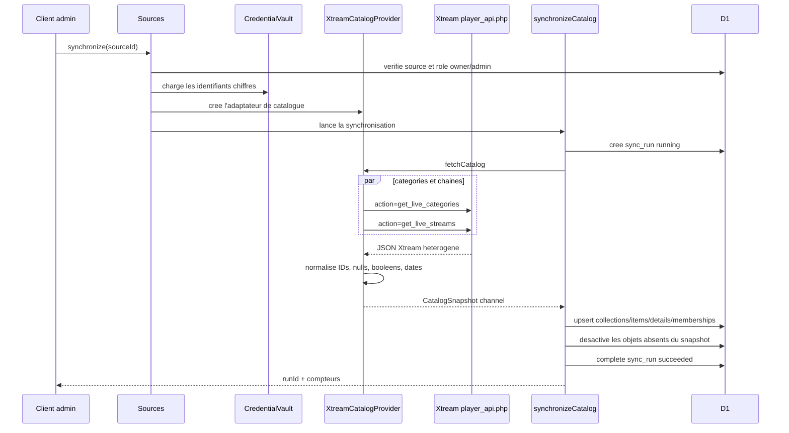

L'adaptateur normalise notamment :

- `category_id`, `stream_id`, `num` et les IDs EPG, qui peuvent etre nombres,
  chaines ou `null` ;
- les flags `is_adult` et `tv_archive` en booleens ;
- la duree `tv_archive_duration` en secondes de fenetre de rattrapage ;
- `added`, qui vient en secondes Unix, en millisecondes ;
- les logos et categories absents.

### Reconciliation et historique

Une synchronisation reussie est un snapshot complet pour les types declares.
Pour chaque element observe, le backend fait un `upsert`. Ensuite, pour les
types effectivement synchronises, il desactive les collections et `source_items`
non observes. Il ne les supprime pas. Cette stabilite des IDs est necessaire
pour de futurs favoris, historique ou rapprochements.

Si une requete fournisseur ou la persistence echoue, le `sync_run` passe a
`failed`, conserve un code d'erreur et un message assaini. Une synchronisation
echouee ne desactive jamais les donnees precedentes.

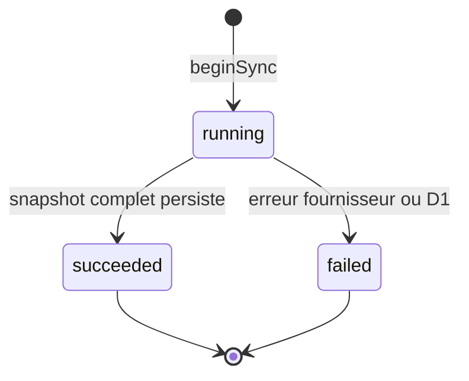

### Lecture directe actuelle

`POST /v1/sources/:sourceId/channels/:channelId/playback` verifie le droit au
foyer, recupere le `stream_id` externe de la chaine, charge les identifiants et
demande a l'adaptateur Xtream un `PlaybackDescriptor`.

Pour Xtream live, ce descripteur contient actuellement une URL de la forme :

```text
https://fournisseur.example/live/{username}/{password}/{streamId}.m3u8
```

ou, a la demande, une variante MPEG-TS se terminant par `.ts`. Le client TV
lit ensuite le flux directement chez le fournisseur.

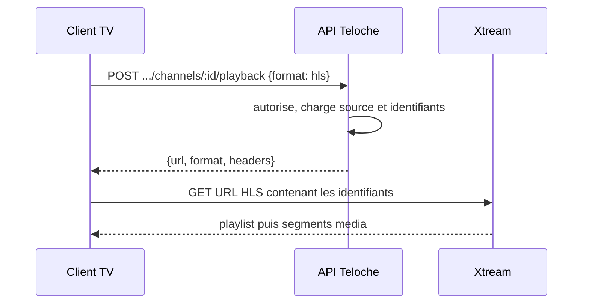

Ce choix de **lecture directe** a ete confirme pour l'instant : il est plus
simple, moins couteux et ne fait pas transiter la video par Teloche. Sa
contrepartie est nette : l'URL remise au TV comporte les identifiants Xtream.
Un futur mode proxy devra etre optionnel et pilote par les capacites ou la
politique d'une source, pas impose a tous les fournisseurs.

## Endpoints Teloche implementes

| Methode et chemin | Authentification actuelle | Intention |
| --- | --- | --- |
| `GET /health/database` | publique | Verifie l'acces D1 et retourne le nombre de sources. |
| `POST /v1/users` | publique | Cree un utilisateur et son premier foyer owner. |
| `GET /v1/households` | header provisoire | Liste les foyers de l'utilisateur courant. |
| `POST /v1/households/:householdId/sources` | owner/admin | Cree une source Xtream et chiffre ses identifiants. |
| `GET /v1/households/:householdId/sources` | membre | Liste les sources du foyer. |
| `GET /v1/sources/:sourceId` | membre | Lit une source accessible. |
| `POST /v1/sources/:sourceId/validate` | owner/admin | Valide les identifiants fournisseur. |
| `POST /v1/sources/:sourceId/sync` | owner/admin | Lance une synchronisation live manuelle. |
| `GET /v1/sources/:sourceId/sync-runs` | membre | Lit l'historique des synchronisations. |
| `GET /v1/sources/:sourceId/collections` | membre | Liste les collections par type de contenu. |
| `GET /v1/sources/:sourceId/channels` | membre | Liste paginee des chaines, avec filtre de collection optionnel. |
| `GET /v1/sources/:sourceId/channels/:channelId` | membre | Lit une chaine. |
| `POST /v1/sources/:sourceId/channels/:channelId/playback` | membre | Produit un descripteur de lecture directe. |
| `GET /docs` | publique | Interface Scalar de la spec OpenAPI Teloche. |
| `GET /openapi.json` | publique | Spec OpenAPI Teloche generee par Effect. |

Les schemas de requete et de reponse sont dans
`apps/backend/src/api/schemas.ts`. L'interface Scalar est le moyen le plus
simple de verifier la forme exacte avant d'ecrire le client TV.


## Lexique complet

Ce lexique donne le sens precis des noms employes dans le code. Lorsqu'un terme
est anglais, il est conserve car il apparait dans les fichiers, mais sa
definition est en francais.

| Terme | Sens dans Teloche |
| --- | --- |
| **Adapter / adaptateur** | Implementation d'un protocole fournisseur. Il traduit le monde Xtream, M3U/XMLTV ou Stalker vers le contrat Teloche. |
| **Adapter key** | Cle technique de l'adaptateur, par exemple `xtream`, stockee sur une source. |
| **Alchemy** | Outil d'infrastructure qui declare et deploie le Worker et D1 sur Cloudflare. |
| **API Teloche** | Contrat HTTP propre a l'application. C'est le seul contrat que le client TV doit connaitre. |
| **Catalog / catalogue** | Vue locale, synchronisee et interrogeable des contenus accessibles depuis une source. |
| **Catalog item** | Item interne destine a devenir canonique. Aujourd'hui il reste techniquement propre a une source. |
| **CatalogProvider** | Petit contrat interne qui produit un `CatalogSnapshot`. Xtream en fournit une implementation. |
| **CatalogSnapshot / snapshot** | Photographie complete de collections et d'items, renvoyee par un adaptateur pour un ou plusieurs types de contenu. |
| **Catch-up / rattrapage** | Capacite de rejouer un programme passe. Xtream expose `tv_archive` et une duree ; Teloche les normalise mais ne fournit pas encore l'interface de lecture. |
| **Channel / chaine** | Contenu live. C'est le seul type reellement synchronise et lisible aujourd'hui. |
| **Collection** | Regroupement fournisseur, typiquement une categorie de chaines. Une collection peut avoir une collection parente. |
| **Collection item** | Table de jointure indiquant qu'un `source_item` se trouve dans une collection, avec sa position. |
| **Content kind** | Famille d'un contenu : `channel`, `movie` ou `series`. Les deux derniers existent dans le modele mais ne sont pas implementes. |
| **Credential cipher** | Service qui chiffre/dechiffre les secrets avec AES-256-GCM. |
| **Credential envelope** | Representation stockee du secret chiffre : version, algorithme, key ID, IV et ciphertext. |
| **Credential store** | Repository D1 de l'enveloppe chiffree dans `source_credentials`. |
| **Credential vault** | Facade de haut niveau pour stocker ou charger des identifiants. Les cas d'usage ne manipulent pas les details de chiffrement. |
| **CurrentUser** | Service Effect contenant l'ID de l'utilisateur courant apres le middleware HTTP. |
| **D1** | Base SQLite managee de Cloudflare. C'est la persistence du backend. |
| **Descriptor de lecture / PlaybackDescriptor** | Reponse generique destinee au lecteur media : URL, format, headers et expiration optionnelle. |
| **Direct playback / lecture directe** | Le TV recoit une URL fournisseur et lit la video directement. C'est le mode actuel. |
| **Drizzle** | Bibliotheque utilisee pour declarer le schema D1 et generer les migrations. |
| **Effect Context** | Mecanisme Effect qui rend une dependance disponible a un programme sans la passer manuellement partout. |
| **Effect Layer** | Construction et assemblage de services Effect. Ici, les services sont assembles dans le Worker. |
| **Endpoint fournisseur** | Base URL non secrete d'une source. Les identifiants n'y sont pas acceptes. |
| **EPG** | Electronic Program Guide : grille des programmes, emissions et horaires. Les IDs EPG sont conserves lorsqu'ils existent, mais les programmes ne sont pas encore synchronises. |
| **External ID** | Identifiant du fournisseur, par exemple le `stream_id` Xtream. Il ne doit pas devenir l'ID public du client TV. |
| **Foyer / household** | Unite de partage : les membres peuvent voir les sources du foyer selon leur role. |
| **Household membership** | Relation utilisateur-foyer, portant le role `owner`, `admin` ou `member`. |
| **HTTP API / HttpApi** | Module Effect declarant routes, schemas, erreurs et OpenAPI. |
| **ID interne** | Identifiant controle par Teloche, employe par les endpoints Teloche et stable tant que l'objet est conserve. |
| **IV / initialization vector** | Valeur aleatoire unique employee par AES-GCM pour chiffrer une occurrence de secret. |
| **Kysely** | Constructeur de requetes SQL typees. Il est utilise par les repositories, pas par le domaine fournisseur. |
| **Key ID** | Identifiant de la cle de chiffrement, aujourd'hui `v1`. Il permettra une rotation de cle. |
| **Master key** | Secret de 32 octets base64 dans `TELOCHE_CREDENTIAL_MASTER_KEY`, necessaire pour chiffrer et dechiffrer les identifiants. |
| **Member** | Role de foyer qui peut consulter catalogue et lecture, sans administrer la source. |
| **M3U** | Format texte de playlist media. Il est futur adaptateur potentiel, non implemente. |
| **MPEG-TS** | Format de flux transport. Xtream peut fournir une URL `.ts` pour la lecture live. |
| **Migrations** | Evolutions SQL versionnees de la structure D1. |
| **Owner** | Role de foyer ayant tous les droits actuels sur les sources. |
| **Playback format** | Format souhaite au moment de la lecture : `hls` ou `mpeg-ts`. |
| **Provider account** | Resume normalise de la reponse de verification fournisseur : statut, expiration, connexions et formats acceptes. |
| **ProviderAdapter** | Contrat commun de validation, catalogue et lecture qu'implemente un adaptateur. |
| **Provider-neutral / fournisseur neutre** | Qui ne depend pas de champs, URLs, actions ou IDs propres a Xtream. |
| **Proxy playback** | Mode futur ou Teloche relaie/proxyfie le media afin de ne pas transmettre les identifiants fournisseur au TV. |
| **Reconciliation** | Mise a jour d'un catalogue local a partir d'un snapshot complet : upsert de l'observe puis desactivation de l'absent. |
| **Scalar** | Interface web servant un document OpenAPI interactif a `/docs`. |
| **Source** | Une souscription/connexion IPTV d'un foyer : adaptateur, endpoint, nom et credentials chiffres. |
| **Source channel details** | Informations propres a une chaine d'une source : ID EPG, adulte, rattrapage et fenetre de rattrapage. |
| **Source item** | Representation d'un item telle qu'une source le fournit, avec son ID fournisseur et ses metadonnees propres a la source. |
| **Sync run** | Une tentative tracee de synchronisation d'une source : statut, dates, compteurs et erreur assainie. |
| **Timeshift** | Lecture decalee dans le temps. Le modele conserve les indices Xtream de rattrapage mais le comportement de lecture n'est pas encore implemente. |
| **Trusted development header** | `x-teloche-user-id`, mecanisme temporaire qui simule une identite pendant le developpement. |
| **User / utilisateur** | Identite Teloche qui appartiendra plus tard a une vraie authentification et a des appareils pares. |
| **Worker** | Runtime Cloudflare qui recoit les requetes HTTP et execute le backend sans serveur Node permanent. |
| **Wrangler** | Outil Cloudflare de developpement local, migrations et execution du Worker. |
| **XMLTV** | Format XML courant pour les programmes EPG. Il sera pertinent avec un adaptateur M3U/XMLTV, mais n'est pas encore ingere. |
| **Xtream / Xtream-compatible** | Protocole IPTV de fait observe dans les APK. Sa compatibilite varie selon les serveurs. |

## Securite et limites actuelles

### Ce qui est deja protege

- Les credentials fournisseur sont stockes avec AES-256-GCM, jamais en clair
  dans les tables de configuration.
- Le chiffrement lie cryptographiquement le `sourceId` et l'`adapterKey` au
  secret, afin qu'une enveloppe ne soit pas deplacee silencieusement vers une
  autre source ou un autre adaptateur.
- L'endpoint d'une source refuse les credentials integres dans son URL.
- Les operations de catalogue et lecture verifient l'appartenance au foyer.
- Les erreurs de sync conservees en base sont assainies, au lieu de persister
  une reponse distante complete pouvant contenir des donnees sensibles.
- Aucun payload Xtream brut, URL de lecture construite, mot de passe ou nom
  d'utilisateur fournisseur n'est prevu dans D1.

### Ce qui reste insuffisant pour la production

- Le header `x-teloche-user-id` est forgeable et n'est pas une authentification.
- Il n'y a pas de pairage TV, session, expiration de session, rate limiting ni
  audit d'acces aux credentials.
- Le mode direct transmet des identifiants fournisseur au lecteur TV via l'URL
  Xtream. Il faut en connaitre et accepter les consequences avant un usage
  sensible.
- La rotation de cle est preparee par `keyId`, mais pas encore implementee.
- Il n'existe pas encore de politique de logs, d'alertes, de sauvegarde,
  d'observabilite ni de retry/backoff de synchronisation.

## Ce qui est teste et ce qui ne l'est pas encore

Les tests backend passent actuellement avec Vitest et le pool Cloudflare :

- chiffrement/dechiffrement AES-GCM, y compris les metadonnees authentifiees ;
- normalisation des types Xtream incoherents ;
- persistence d'un catalogue complet de 4 110 chaines ;
- reconciliation, desactivation des objets absents et echec de sync ;
- API Worker : inscription, creation de source, ciphertext seul dans D1,
  lecture directe et refus sans identite ;
- compatibilite de la migration qui rattache une ancienne source a un foyer de
  migration.

Les principaux manques de tests correspondent aux fonctions pas encore
realisees : authentification reelle, pairage, invitations, synchronisation
planifiee, EPG, VOD, proxy, DRM, comportement media Android TV et interop avec
une diversite de serveurs Xtream reels.


## Outillage et execution

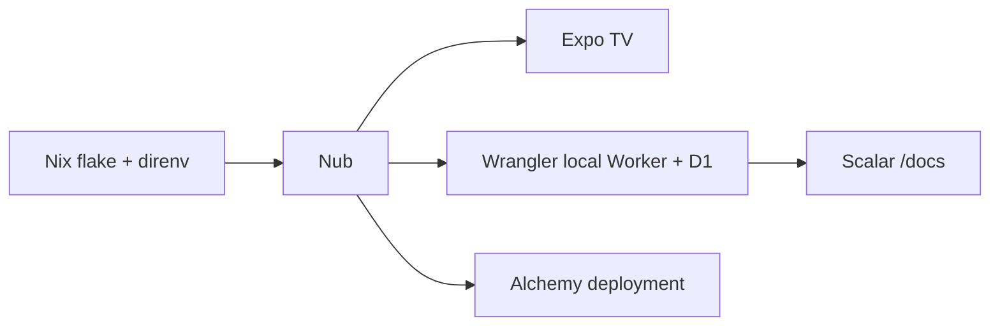

| Commande | Usage |
| --- | --- |
| `direnv allow` | Charge l'environnement Nix declare dans `.nix`. |
| `nub install --ignore-scripts` | Installe les dependances du monorepo. |
| `nub run dev:backend` | Applique les migrations D1 locales et lance le Worker. |
| `nub run dev:xtream-docs` | Lance la documentation separee de l'API Xtream observee. |
| `nub run db:migrate:local` | Applique seulement les migrations D1 locales. |
| `nub run test` | Lance les tests backend. |
| `nub run typecheck:backend` | Lance la verification TypeScript 7 du backend. |
| `nub run dev:tv` | Lance le projet Expo TV, encore placeholder. |

Nix fournit Node 24, Nub, le JDK, ADB, Git et `jq`. L'environnement imprime
leurs versions a l'entree. `comma` reste utile pour lancer ponctuellement un
outil Nix sans l'installer globalement pendant les recherches APK.

## Ordre de revue conseille

Pour comprendre le code sans se perdre dans les details, lire dans cet ordre :

1. Ce document, puis `docs/todo.md` pour savoir ce qui est assume incomplet.
2. `apps/backend/src/api/contract.ts` pour voir exactement la promesse HTTP.
3. `apps/backend/src/routes.ts` pour voir le raccord contrat -> services.
4. `apps/backend/src/sources/service.ts` et `tenancy/service.ts` pour les
   regles metier et d'autorisation.
5. `apps/backend/src/adapters/xtream/adapter.ts` et `catalog-provider.ts` pour
   la frontiere avec Xtream.
6. `apps/backend/src/catalog/sync.ts` et `catalog/repository.ts` pour le cycle
   de synchronisation et les ecritures D1.
7. `apps/backend/src/db/schema.ts` et les migrations pour le modele persiste.
8. `apps/backend/src/worker.ts` et `apps/backend/alchemy.run.ts` pour
   l'assemblage runtime et l'infrastructure.
9. Les tests `*.test.ts`, qui donnent les scenarios executables les plus
   concrets.

## Decisions a confirmer pendant la revue

Ces questions ne sont pas des blocages du code actuel, mais elles orienteront
le prochain lot de travail :

1. Quel mecanisme de compte et de pairage TV remplacera le header de
   developpement ?
2. Un foyer a-t-il des profils individuels des le debut, ou seulement des
   membres avec preferences partagees ?
3. Quelle politique de synchronisation adoptons-nous : manuelle d'abord,
   planifiee plusieurs fois par jour ensuite, avec quel backoff ?
4. Quel niveau de protection attend-on des credentials fournisseur : le mode
   direct suffit-il pour certains fournisseurs, et quand bascule-t-on en proxy ?
5. Comment unifier des chaines equivalentes venant de plusieurs sources : EPG,
   metadata publique, regles manuelles ou aucun rapprochement initial ?
6. Faut-il introduire l'EPG avant le premier vertical slice TV, ou le traiter
   comme un second slice apres la navigation et la lecture live ?
7. Quelles capacites le descripteur de lecture doit-il promettre avant le client
   TV : headers, sous-titres, pistes audio, DRM, rattrapage et diagnostics ?

## Prochaine etape recommandee

La prochaine implementation devrait etre le **socle d'identite et de pairage
TV**, pas encore l'interface TV complete ni un nouvel adaptateur fournisseur.
Elle doit remplacer le faux header par un flux que le TV peut utiliser de facon
ergonomique au D-pad : creer/associer un appareil, etablir une session, choisir
un foyer et porter cette identite jusqu'aux endpoints existants.

Une fois ce contrat stabilise, le premier vertical slice TV devient petit et
verifiable : s'identifier, choisir une source deja synchronisee, parcourir une
collection, ouvrir une chaine et jouer le `PlaybackDescriptor`. Ce slice
validera a la fois l'API Teloche et l'integration React Native TV/Media3 sans
introduire prematurement l'EPG, le proxy, le VOD ou les fonctions sociales.

